# Procesverslag
Markdown is een simpele manier om HTML te schrijven.  
Markdown cheat cheet: [Hulp bij het schrijven van Markdown](https://github.com/adam-p/markdown-here/wiki/Markdown-Cheatsheet).

Nb. De standaardstructuur en de spartaanse opmaak van de README.md zijn helemaal prima. Het gaat om de inhoud van je procesverslag. Besteedt de tijd voor pracht en praal aan je website.

Nb. Door *open* toe te voegen aan een *details* element kun je deze standaard open zetten. Fijn om dat steeds voor de relevante stuk(ken) te doen.

## Jij

### Ontwerper:
Dilay Bayraktaroglu

#### Je startniveau:
Mijn startniveau is: voornamelijk blauw, maar misschien voeg ik nog rode piste dingen toe

# Je plan

  
De eerste versie/schets van je ontwerp & je persoonlijke uitdaging

  ### De eerste versie/schets:
  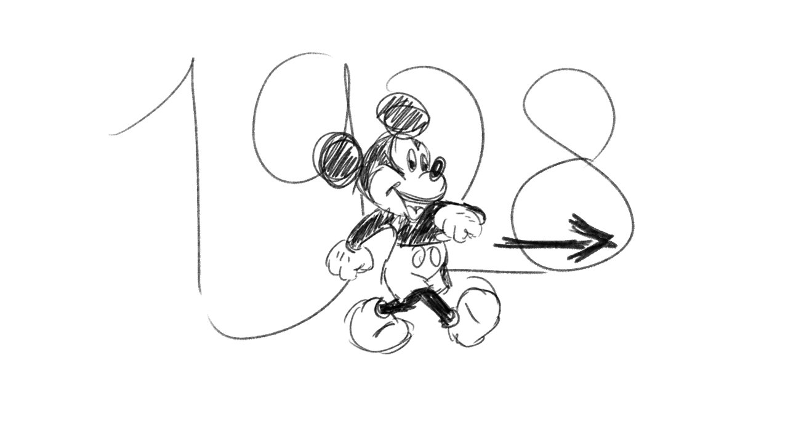
  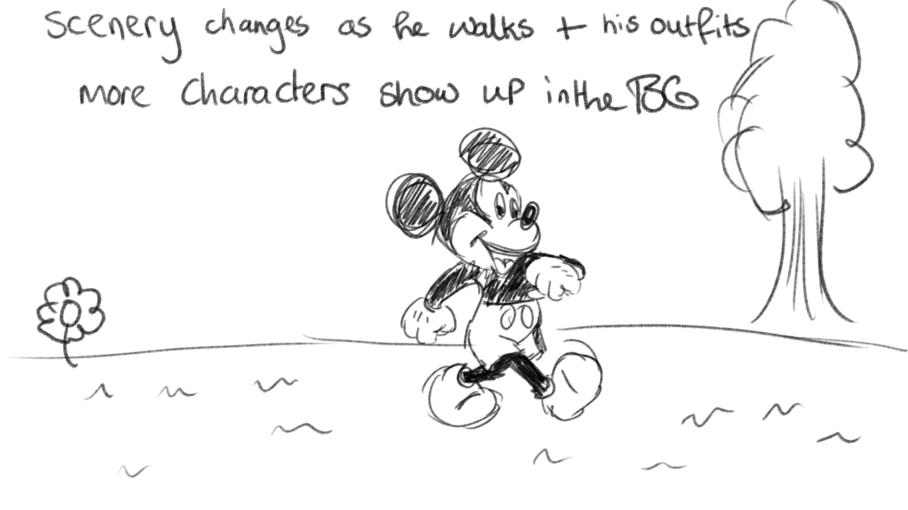
  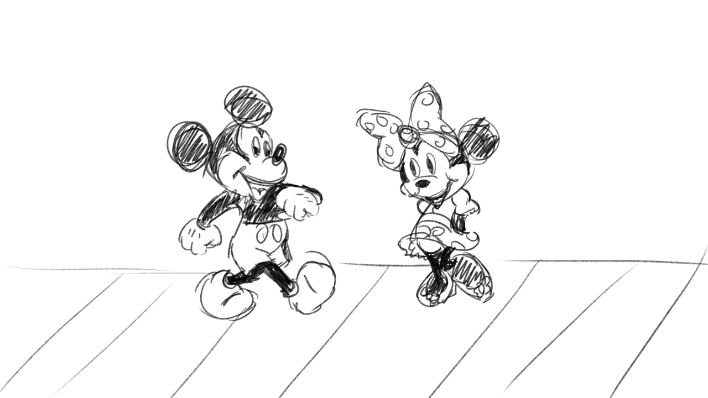

  ### Je ambitie: 
  Aan deze technieken/punten wil ik werken:
  - Beter worden in animeren met CSS - heel misschien JS als ik het niet te moeilijk vind
  - ~~Horizontaal scrollen heb ik nooit gedaan dus dat lijkt me leuk om uit te proberen~~
  - In het algemeen weer het coderen een beetje oppakken
  - Een cosy gevoel geven aan de gebruiker van mijn boekje - focussen op UX
  - Beter worden in visualisaties en het 'aesthetically pleasing' maken

  ### To-Do List:
  - ~~Dark Mode~~
  - X Eigen Tekeningen per pagina 
  - ~~Font-Face dingen doen~~
  - ~~Overlays~~
  - ~~Tekst klopt nog niet helemaal (nth-of-type checken)~~
  - ~~Laatste pagina 'the end'~~
  - X page flip sound 
  - X progressie balk -> hoeveel pagina's nog
  - X toegankelijkheid (met knopjes door de pagina's)
  - ~~focus (visible), active toevoegen~~

 

## Voortgang/Feedback 1

  
Mijn bevindingen + wijzigingen (minimaal 5)

  ### Bevinding 1:
  Omschrijving van wat er nog niet orde was (tekst en afbeeding(en)).
  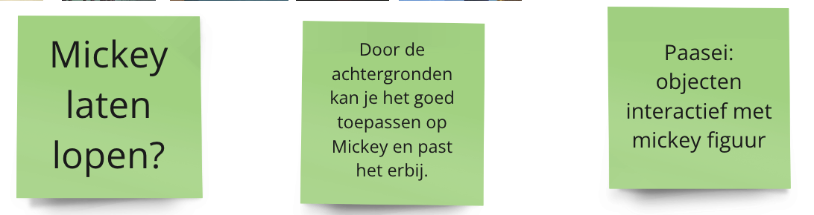
  - Misschien moet ik minder 'soorten' Mickeys gebruiken (De belangrijkste/bekendste Mickeys)
  - Objecten en andere characters interactief maken met Mickey
  - Nadenken over de bediening (Scrollen of met een knop)
  - De achtergronden maakt het interessanter
  - Easter egg: Characters die uit een object verschijnen bijvoorbeeld
  - Easter egg: Referenties naar andere elementen waar Mickey in voorkomt (In Aladdin is er bijvoorbeeld een referentie naar Mickey waarbij 'Genie' de Steamboat Willie tune fluit)

  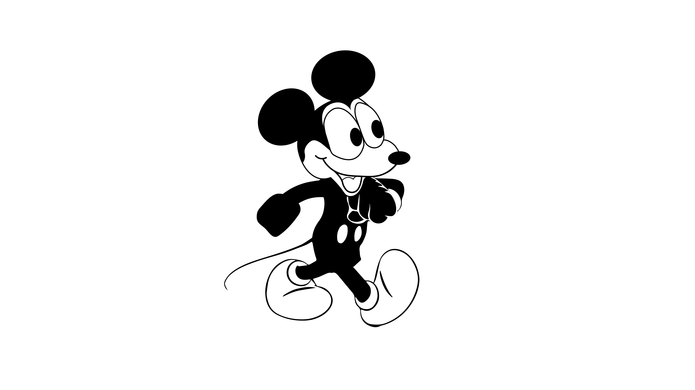

  #### oplossing:
  Beschrijving hoe je het hebt hebt opgelost of als het niet gelukt is hoe je het zou oplossen (tekst en afbeeding(en)).
  Ik heb eigenlijk na dag 1 besloten om van character te veranderen. Sinds Mickey Mouse copyright .... heeft, kan ik dit project bijvoorbeeld niet op mijn portfolio zetten. Dus ga ik kiezen om door te gaan met Winnie The Pooh. Winnie is nu namelijk public domain, waardoor ik geen zorgen hoef te maken over copyright.

  ### Bevinding 2:
  Omschrijving van wat er nog niet orde was (tekst en afbeeding(en)).

  #### oplossing:
  Beschrijving hoe je het hebt hebt opgelost of als het niet gelukt is hoe je het zou oplossen (tekst en afbeeding(en)).

  ### Bevinding 3:
  ...

## Voortgang/Feedback 2

  
Mijn bevindingen + wijzigingen (minimaal 5)

  
  ### Bevinding 1:
  Meer easter eggs - honing pot van pooh bijvoorbeeld toevoegen

  #### oplossing:
  Ik heb een honingpot button toegevoegd
  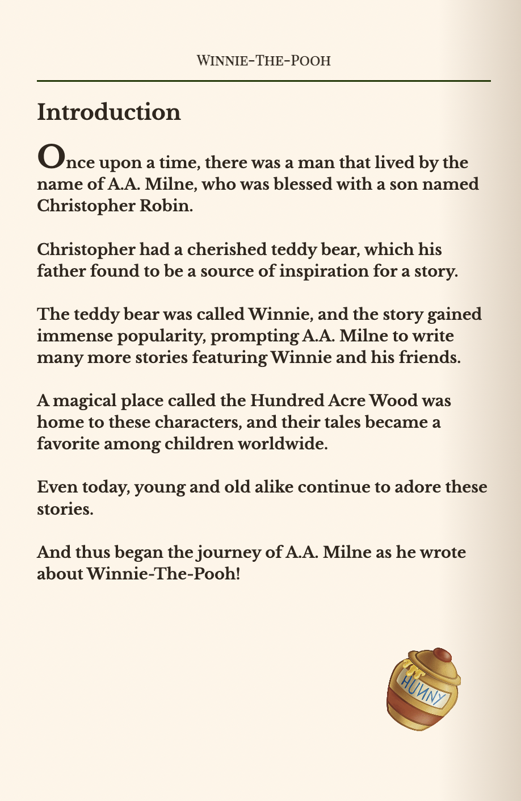

  ### Bevinding 2:
  Code netjes maken - het staat een beetje door elkaar heen nu

  #### oplossing:
  Ik heb bij sommige plekken extra kopjes gegeven en meer ingesprongen
  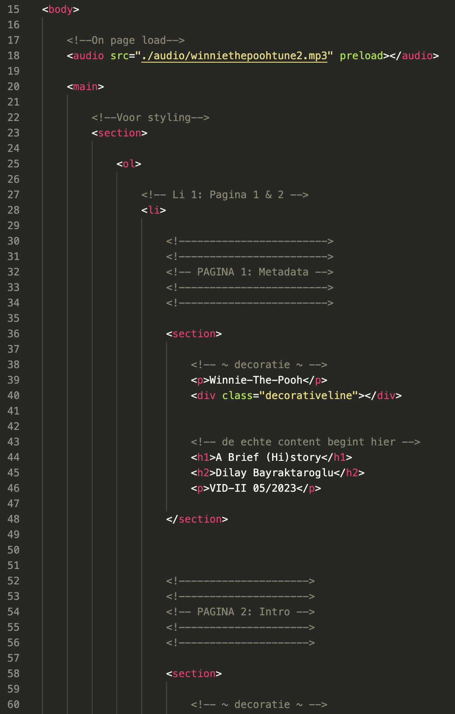

  ### Bevinding 3:
  Misschien iets met audio doen

  #### oplossing
  Ik heb audio toegevoegd die afspeelt in de achtergrond 

  

## Voortgang/Feedback 3

  
Mijn bevindingen + wijzigingen (minimaal 5)

  
  ### Bevinding 1:
  Het einde is een beetje leeg dus daar kan ik nog iets mee doen. Ik had alleen een tekst the end en een niet werkend linkje eerst

  #### oplossing:
  Ik heb een afbeelding toegevoegd 
  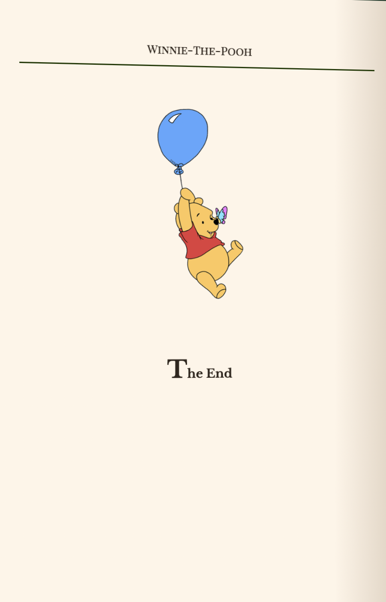

  ### Bevinding 2:
  tabben gaat niet soepel

  #### oplossing:
  Geen idee hoe ik dit kan oplossen. Ik heb er uren aan gezeten maar heb niet genoeg kennis om in te zien wat ik fout doe.

  ### Bevinding 3:
  Tigger bijvoorbeeld toevoegen die door het scherm springt

  #### oplossing
  Heb hier geen tijd meer voor gehad.

## Reflectie

  
Mijn eindresultaat & persoonlijke ontwikkeling

  ### Je uitkomst - karakteristiek screenshot(s):
  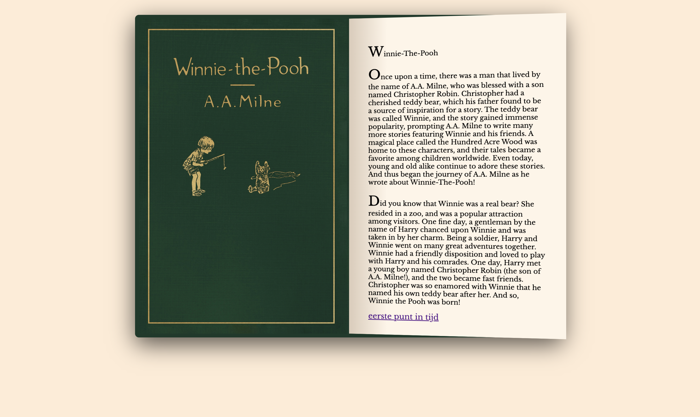
  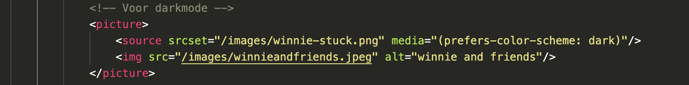
  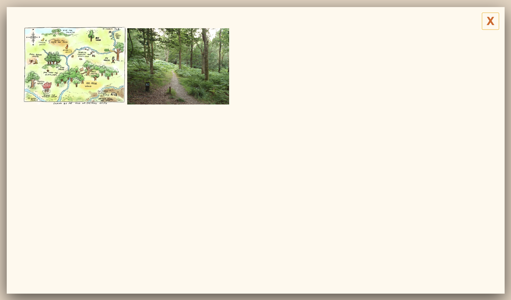
  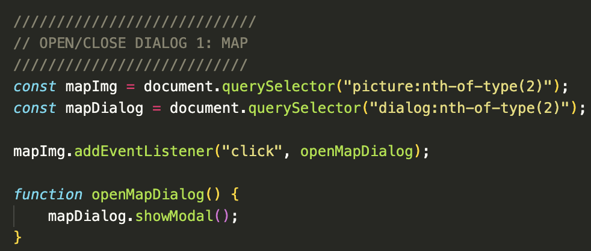
  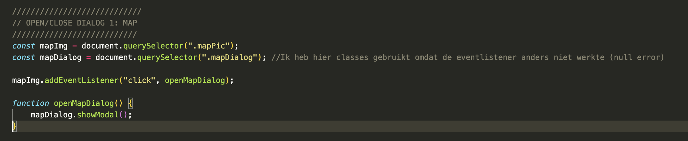

  ### Dit ging goed/Heb ik geleerd: 
  Ik gebruikte eerder veel classes maar dit keer heb ik beter begrepen hoe ik selectoren kan gebruiken (nth-of-type). Ik ben hierdoor ook meer gaan commenten tussen mijn werk door waardoor ik sneller weer wist waar ik was gebleven.

  ### Dit was lastig/Is niet gelukt:
  Pagina omslaan met knoppen, progressiebar zijn niet gelukt. Ik wilde een navigatie maken met het keyboard, maar dit is een van de minst
  accessible pagina's geworden helaas. Ook wilde ik nog een progressiebar en een knop op het einde waar je op kunt klikken om terug naar het begin te gaan.  Ik heb wel veel tijd besteed om te onderzoeken hoe je met links en rechts knoppen bedient maar het lukte uiteindelijk maar op 1 pagina.

  Ook kostte het super veel tijd om alle afbeeldingen over te trekken. Daarom heb ik maar afbeeldingen gebruikt tussen mijn eigen werk door.

  Ik heb eigenlijk tijd tekort gehad voor de opdracht. Ik had ook vragen maar door de vakantie kon ik ze niet stellen.

  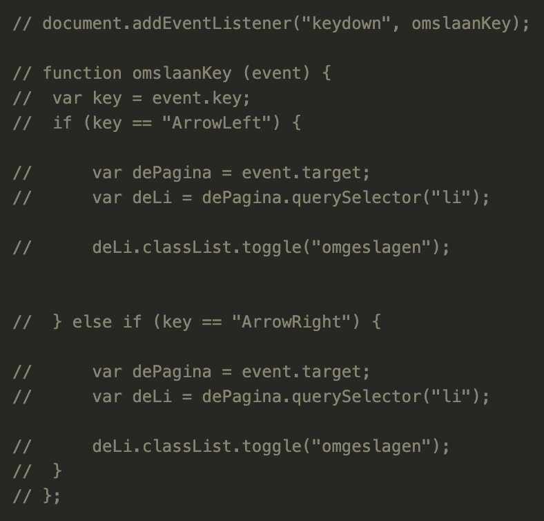

  ### ~
  Ookal heb ik mijn website niet af gekregen, ben ik best trots op wat ik heb bereikt. Ik durf meer dingen uit te proberen en heb zeker veel over JS geleerd. Ik denk om voor de herkansing te gaan om het boekje af te maken en het accessible te maken. Ik vond het een leuke opdracht waarbij ik het coderen weer een beetje heb opgepakt. 

## Bronnenlijst

continu bijhouden terwijl je werkt

Nb. Wees specifiek ('css-tricks' als bron is bijv. niet specifiek genoeg).

1. Honey pot img: https://www.pngaaa.com/detail/2767366
2. Dark mode afbeeldingen https://moduscreate.com/blog/dark-mode-images/
3. Dark mode afbeeldingen 2 https://larsmagnus.co/blog/how-to-make-images-react-to-light-and-dark-mode
4. img echte winnie https://www.wbur.org/hereandnow/2015/11/04/true-story-of-pooh
5. img robin en winnie the pooh bear https://www.smithsonianmag.com/arts-culture/winnie-pooh-became-household-bear-180967090/
6. piglet img (traced) https://themediaameetingpoint.wordpress.com/2013/02/05/act-01-designing-cartoons/winnie/
7. eeyore img (traced) https://disneyjuniorpedia.fandom.com/wiki/Eeyore
8. kanga & roo img (traced) https://comicvine.gamespot.com/kanga/4005-34021/
9. tigger img (traced) https://pooh.fandom.com/wiki/Tigger?file=Tigger_2011.png
10. owl img (traced) https://characters.fandom.com/wiki/Owl_(Winnie_the_Pooh) & https://www.disneyclips.com/images2/owl.html
11. rabbit img (traced) https://en.wikipedia.org/wiki/Rabbit_%28Winnie-the-Pooh%29
12. Ashdown forest img https://www.geograph.org.uk/photo/5842451
13. ChatGPT voor hulp met de tekst - input eigen text, gevraagd of het in de stijl van A.A. Milne kon
14. Arrow down gif https://giphy.com/stickers/HASPA-down-hamburg-haspa-Wtg8Bmgul1Qxc0otod
15. Audio gif https://giphy.com/stickers/Loquay-audio-loquay-enciende-el-MeDFeqDC4EMFiKEEMn
16. Audio gif black https://giphy.com/stickers/Loquay-audio-loquay-enciende-el-RhqcTZmOPi4iMzQZ5g
17. Sound icon by Icons8 https://icons8.com/icons/set/sound--white
18. child sitting on bench https://www.express.co.uk/entertainment/books/721024/Winnie-Pooh-celebrates-90-anniversary-years-philosophical-talks-UK
19. Evolution pooh https://poohlovers.tumblr.com/post/120931701513/the-evolution-of-disneys-winnie-the-pooh
20. Friends looking up https://people.com/books/winnie-the-pooh-day-book-history/
21. Sanne voor de hulp tijdens de les en codepens

